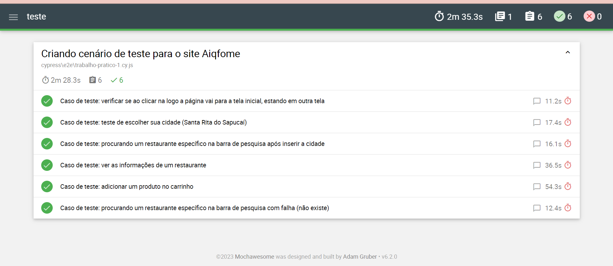

## S206 - L1

> Repositório da disciplina de Qualidade de Software no Inatel

# Preparando o ambiente do Cypress 💻

Instale o cypress pela sua linha de comando
```
npm install cypress
```
ou diretamente pelo site 
```
https://download.cypress.io/desktop
```

# Para executar o Cypress

Pela linha de comando, rode as specs: 
```
./node_modules/.bin/cypress run --spec 'cypress/e2e/trabalho-pratico-1/'
```
Dessa maneira também será obtido o arquivo HTML



-------------------------------------------------------------------------------------

# Preparando o ambiente do Karate 💻

Instale o JDK (Java)
https://www.oracle.com/java/technologies/javase-downloads.html

e o Maven
https://maven.apache.org

Na linha de comando:
```
mvn clean install
```

# Para executar o Karate

Pela linha de comando, rode:
```
cd S206L1/aula_karate
```
```
mvn test –Dtest=lotrRunner
```

